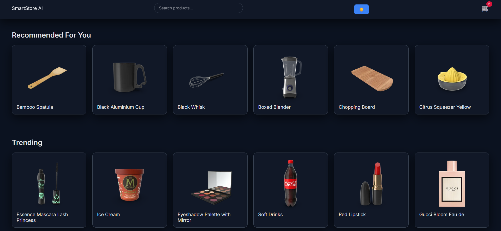
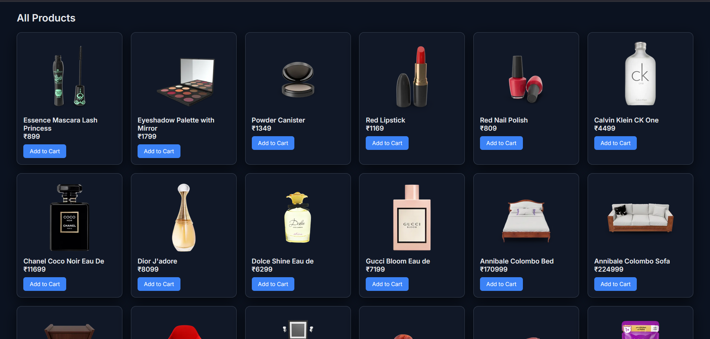
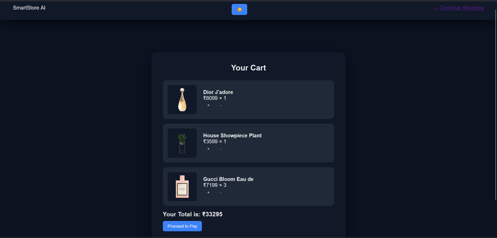

🛍 SmartStore AI

🔗 **Live Demo:** [View Live Project](https://smartstore-ai.vercel.app/)
An intelligent frontend e-commerce system built using HTML, CSS, and Vanilla JavaScript (ES6 Modules).
The application simulates modern commerce features including smart search ranking, demand-based trending, product recommendations, persistent cart management, and dark mode support.

🚀 Features

🔍 Smart Search with weighted ranking logic

📈 Trending products based on user interaction tracking

🧠 Content-based recommendation engine

🛒 Persistent shopping cart using LocalStorage

🌙 Dark / Light theme toggle

⚡ Dynamic product rendering from REST API

📱 Fully responsive layout

🛠 Tech Stack

HTML5

CSS3 (CSS Variables + Responsive Design)

JavaScript (ES6 Modules)

REST API (DummyJSON)

LocalStorage (State Persistence)

🧠 Project Architecture
## 🧠 Project Architecture

```
smartstore-ai/
│
├── index.html
├── cart.html
│
├── styles/
│   └── main.css
│
├── modules/
│   ├── store.js        // Centralized state management
│   ├── cart.js         // Cart business logic
│   └── ai.js           // Search, trending & recommendation logic
│
├── main.js             // Homepage controller
└── cartpage.js         // Cart page controller
```


📊 Core Functionalities
🔹 Centralized State Management

Maintains cart, demand tracking, and viewed products

State persisted using LocalStorage

Shared across modules

🔹 Intelligent Search Ranking

Implements weighted scoring:

Title match → High weight

Category match → Medium weight

Tag match → Lower weight

Search results are dynamically sorted by relevance score.

🔹 Trending Algorithm

Tracks demand based on product views and cart actions

Displays top interacted products dynamically

🔹 Recommendation System

Tracks viewed product history

Suggests products from similar categories

Simulates behavior-based filtering

🔹 Persistent Cart

Add / Remove products

Quantity control

Real-time total calculation

Data stored locally

🔹 Theme Engine

Dark/Light toggle

CSS variable-based styling

User preference saved in LocalStorage

🔄 API Used

Products are fetched dynamically from:
https://dummyjson.com/products

📸 Screenshots
<p align="center">    </p>

📌 Future Improvements

Debounced search for performance optimization

Product detail page

Pagination support

Backend integration

ML-based recommendation system

👨‍💻 Author
Ansh Gupta